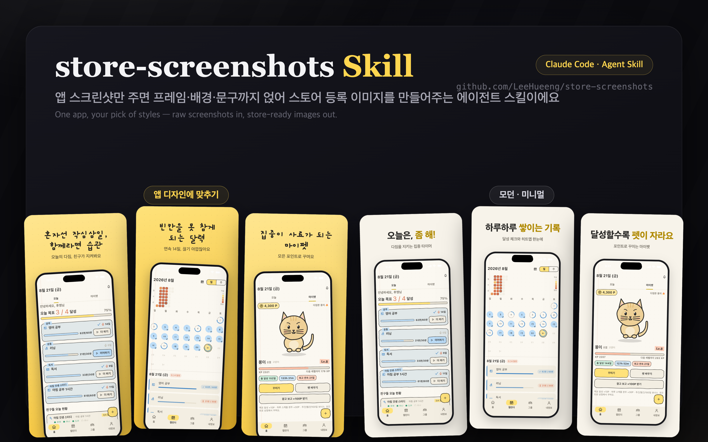
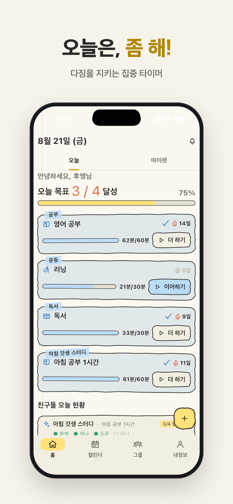

<div align="center">



# store-screenshots

**원본 앱 스크린샷만 주면, 스토어 등록용 마케팅 이미지가 나옵니다.**<br>
기기 프레임 · 브랜드 배경 · 홍보 문구까지 — App Store & Google Play 규격 그대로.

[](LICENSE)
[](https://claude.com/claude-code)
[](#-출력-예시)

</div>

---

앱스토어·플레이스토어에 올릴 마케팅 스크린샷, 매번 피그마 열어서 만들기 귀찮으시죠?
이 스킬은 **원본 앱 스크린샷만 주면** Claude Code가 알아서 만들어줍니다.

## ✨ 무엇을 해주나요

- 📱 **기기 프레임** — iPhone, iPad, Galaxy, **Fold**, **Flip** 프레임을 씌우고
- 🎨 **브랜드 배경** — 앱의 실제 디자인(colors.xml, xcassets, 아이콘)에서 색을 뽑아 배경을 그리고 (모던·미니멀 / 팝 / 다크 프리셋도 선택 가능)
- ✍️ **홍보 문구** — 화면 내용을 읽고 헤드라인·서브카피를 제안하고 (**컨펌 받은 뒤에만** 진행)
- 📐 **스토어 규격 렌더링** — App Store 1320×2868, Play 1080×1920 등 규격에 딱 맞는 PNG로 출력

## 🖼️ 결과물 예시

<div align="center">


*App Store iPhone 6.5″ 규격(1242×2688), "앱 디자인에 맞추기" 스타일로 생성한 예시*

</div>

## 🚀 설치

```bash
git clone https://github.com/LeeHueeng/store-screenshots.git
cp -r store-screenshots/store-screenshots ~/.claude/skills/
```

| 범위 | 위치 |
|------|------|
| 모든 프로젝트에서 사용 | `~/.claude/skills/` (위 명령) |
| 특정 프로젝트에서만 사용 | 그 프로젝트의 `.claude/skills/`에 복사 |

## 💬 사용법

Claude Code에서:

```
/store-screenshots ./screenshots
```

또는 그냥 자연어로 — **"앱스토어 스크린샷 만들어줘"**.

### 진행 흐름

1. **원본 수집** — 폴더에서 스크린샷을 찾고, 없으면 Claude가 **직접 앱을 조작해서** 캡처합니다.
   - Android: `adb` tap/screencap · iOS 시뮬레이터: 딥링크(`simctl openurl`) 우선 → idb · Maestro · AppleScript
   - 상태바는 9:41 · 배터리 100%로 통일
   - 사용자는 화면을 넘길 필요 없음 — 선택지 고르기와 문구 컨펌만 하면 됩니다
   - 재실행이면 "기존 스크린샷 재활용 / 처음부터 새로"를 먼저 물어봅니다
2. **질문 (전부 선택지)** — 플랫폼(App Store / Google Play) → 기종(iPhone, iPad, Galaxy, Fold·Flip) → 스타일(앱 디자인에 맞추기 / 모던·미니멀 / 팝 / 다크) → 장수 → 어필 방향
3. **시안 컨펌** — 문구 초안 표 + 첫 슬라이드 시안 1장을 실제 규격으로 렌더링해 보여주고, OK 받은 뒤에만 전체 렌더링
4. **렌더링** — HTML/CSS로 프레임·배경·문구를 조합해 헤드리스 크롬으로 캡처
5. **검증** — 모든 PNG의 픽셀 크기를 스토어 규격과 대조

## 📦 출력 예시

```
store-screenshots/
├── appstore-iphone-69/01.png …   # 1320×2868
├── appstore-iphone-65/           # 1242×2688 — iPhone은 항상 두 세트
├── appstore-ipad-13/             # 2064×2752
├── play-phone/                   # 1080×1920
└── play-foldable/
```

## ✅ 요구사항

| 필요한 것 | 비고 |
|-----------|------|
| [Claude Code](https://claude.com/claude-code) | 스킬 실행 환경 |
| Chrome 또는 Chromium | 헤드리스 렌더링용 — 없으면 Playwright로 자동 폴백 |
| `sips`(macOS 내장) 또는 ImageMagick | 이미지 크기 검증용 |

## 🧩 특징

- **프레임을 CSS로 직접 그립니다** — 외부 다운로드가 없어 라이선스·네트워크 걱정이 없습니다. 실사 베젤을 원하면 Apple Design Resources 등 공식 소스를 안내합니다.
- **문구는 스크린샷을 실제로 읽고 씁니다** — 어떤 화면인지 파악한 뒤 혜택 중심으로 작성합니다.
- **한국어 기본** — 영어 스토어용 문구 세트도 함께 생성할 수 있습니다.

## 📄 라이선스

[MIT](LICENSE)
