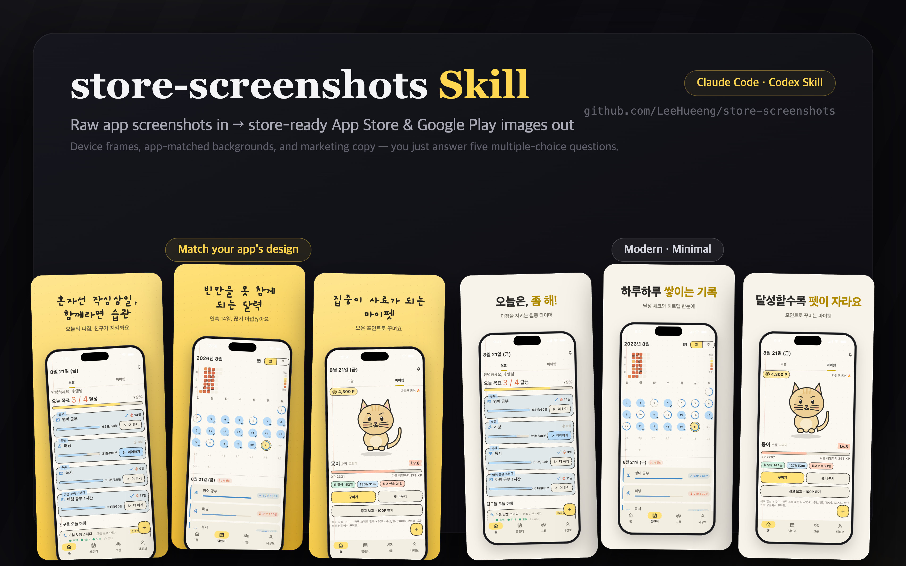

<div align="center">



# store-screenshots

**Raw app screenshots in → store-ready marketing images out.**<br>
An AI agent skill for **Claude Code** & **OpenAI Codex** that adds device frames, branded backgrounds, and benefit-driven copy — at exact App Store & Google Play sizes.

[](LICENSE)
[](https://claude.com/claude-code)
[](https://openai.com/codex)
[](#-store-specs-it-targets)

**English** · [한국어](README.ko.md)

</div>

---

Making App Store and Google Play screenshots by hand — opening Figma, hunting for device mockups, double-checking pixel sizes — gets old fast. This skill turns all of that into one request to your coding agent: point it at your raw screenshots (or let it drive your app and capture them itself), answer a few multiple-choice questions, approve the copy, and get a full set of store-ready PNGs.

## ✨ What it does

- 📱 **Device frames** — iPhone, iPad, Galaxy, **Fold**, **Flip**, drawn in pure CSS (no mockup downloads, no license worries)
- 🎨 **Branded backgrounds** — extracts your app's real design colors (`colors.xml`, `.xcassets`, app icon); Modern/Minimal, Pop, and Dark presets included
- ✍️ **Marketing copy** — reads each screen and proposes benefit-driven headlines and subcopy, and only proceeds **after you approve**
- 📐 **Exact store sizes** — App Store 1320×2868 / 1284×2778, iPad 2064×2752, Google Play 1080×1920, and more — every PNG is pixel-verified
- 🤖 **Hands-free capture** — no screenshots yet? The agent drives your app itself (adb on Android; deep links, idb, or Maestro on the iOS Simulator) with the status bar unified to 9:41 / 100% battery

## 🖼️ Example output

<div align="center">


*App Store iPhone 6.5″ size (1242×2688), generated with the "match my app's design" style*

</div>

## 🚀 Install

```bash
git clone https://github.com/LeeHueeng/store-screenshots.git

# Claude Code
cp -r store-screenshots/store-screenshots ~/.claude/skills/

# Codex
mkdir -p ~/.agents/skills
cp -r store-screenshots/store-screenshots ~/.agents/skills/
```

| Agent | All projects | One project only |
|-------|--------------|------------------|
| Claude Code | `~/.claude/skills/` | `<project>/.claude/skills/` |
| Codex | `~/.agents/skills/` | `<repo root>/.agents/skills/` |

> On older Codex versions the skills path may be `~/.codex/skills/`.

## 💬 Usage

In Claude Code:

```
/store-screenshots ./screenshots
```

In Codex:

```
$store-screenshots ./screenshots
```

(or pick it from `/skills`)

Or just ask in plain language — *"make my App Store screenshots"*.

### How a run goes

1. **Collect originals** — scans your folder for screenshots; if there are none, the agent **operates the app itself** and captures them.
   - Android: `adb` tap/screencap · iOS Simulator: deep links (`simctl openurl`) first, then idb, Maestro, or AppleScript
   - Status bar unified to 9:41 / 100% battery across every capture
   - You never have to touch the device — you only pick options and approve copy
   - On a re-run it first asks: reuse existing screenshots, or start fresh?
2. **Questions (all multiple-choice)** — platform (App Store / Google Play) → devices (iPhone, iPad, Galaxy, Fold, Flip) → style (match my app / modern-minimal / pop / dark) → how many slides → what to highlight
3. **Draft approval** — a copy table plus one fully rendered first slide at real store size; full rendering starts only after your OK
4. **Render** — frame, background, and copy composed in HTML/CSS, captured with headless Chrome
5. **Verify** — every PNG's pixel size is checked against the store spec table

## 📦 Output

```
store-screenshots/
├── appstore-iphone-69/01.png …   # 1320×2868
├── appstore-iphone-65/           # 1242×2688 — iPhone always gets both sets
├── appstore-ipad-13/             # 2064×2752
├── play-phone/                   # 1080×1920
└── play-foldable/
```

## 📏 Store specs it targets

| Target | Size (px, portrait) | Slides | Notes |
|--------|--------------------:|--------|-------|
| App Store iPhone 6.9″ | 1320×2868 | up to 10 | 1290×2796 also accepted |
| App Store iPhone 6.5″ | 1284×2778 | up to 10 | 1242×2688 also accepted |
| App Store iPad 13″ | 2064×2752 | up to 10 | required if the app supports iPad |
| Google Play phone | 1080×1920 | 2–8 | 9:16 · featuring needs ≥1080px and 4+ slides |
| Google Play tablet | 1080×1920 / 1920×1080 | up to 8 | when tablet is supported |
| Google Play foldable | in the phone slot | — | Fold's unfolded screen also works for the tablet slot |

## ✅ Requirements

| You need | Notes |
|----------|-------|
| [Claude Code](https://claude.com/claude-code) or [Codex](https://openai.com/codex) | either one — the skill runs in both |
| Chrome or Chromium | for headless rendering — falls back to Playwright automatically |
| `sips` (built into macOS) or ImageMagick | for pixel-size verification |

## 🧩 Why this instead of a web tool?

- **It reads your actual app.** Colors come from your real design system, and the copy is written from what's actually on each screen — not from a template.
- **It can capture for you.** Most screenshot tools start from images you already have; this one can launch and navigate your app to get them.
- **Nothing leaves your machine.** No uploads, no accounts, no watermarks — plain HTML/CSS rendered locally.
- **Korean-first, English-ready.** Copy defaults to Korean and can generate an English set for international listings in the same layout.

## ❓ FAQ

**What size do App Store screenshots need to be?**
For iPhone, 1320×2868 (6.9″) and 1284×2778 (6.5″) portrait — this skill always renders both sets, because App Store Connect can require the 6.5″ set depending on your app's device support.

**Does it work for Google Play?**
Yes — 1080×1920 phone screenshots (Play's featuring guidelines want at least 1080px and 4+ slides), plus tablet and foldable coverage.

**Do I need Figma or Photoshop?**
No. Frames, backgrounds, and text are composed in HTML/CSS and rendered with headless Chrome.

**Can it make screenshots for a Galaxy Fold or Flip?**
Yes — Fold (with hinge line) and Flip frames are drawn in CSS, and the unfolded Fold screen can double as a Play tablet screenshot.

## 📄 License

[MIT](LICENSE)

---

<div align="center">

If this saved you a Figma session, a ⭐ helps other developers find it.

</div>
